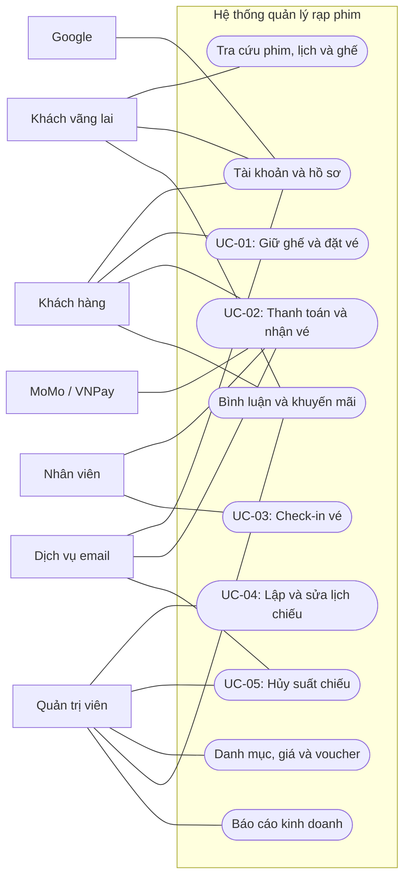
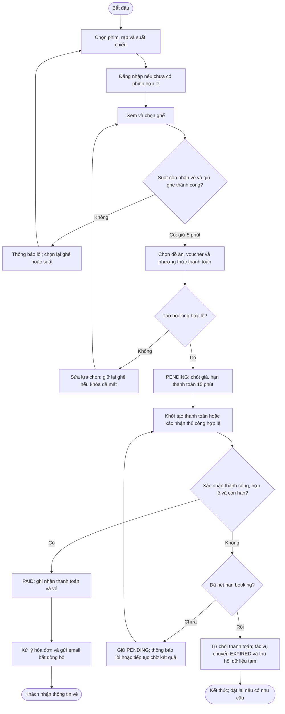
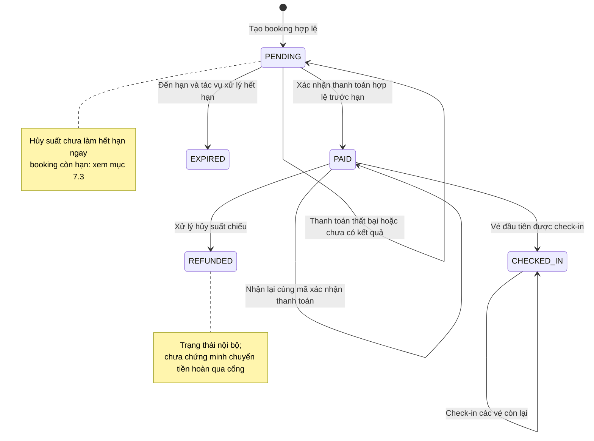

# Đặc tả yêu cầu hệ thống quản lý rạp chiếu phim

## 1. Tổng quan và phạm vi

Hệ thống hỗ trợ khách hàng tra cứu phim, chọn suất chiếu, đặt và thanh toán vé; hỗ trợ nhân viên soát vé và quản trị viên vận hành rạp. Bài toán chính là kết nối lịch chiếu, tình trạng ghế, giá bán và giao dịch trong một quy trình thống nhất, tránh bán trùng ghế và cung cấp dữ liệu phục vụ báo cáo.

Mục tiêu đồ án là trình diễn được luồng từ tra cứu đến check-in với dữ liệu lưu trữ thực, có kiểm tra quyền và xử lý các lỗi nghiệp vụ quan trọng. Khả năng hoàn thành được đánh giá bằng các kịch bản ở mục 7, không chỉ bằng số lượng API.

### 1.1. Phạm vi chức năng

- Tài khoản email/mật khẩu, Google, OTP, khôi phục mật khẩu, hồ sơ và hạng thành viên.
- Tra cứu phim, thể loại, rạp, lịch chiếu và tình trạng ghế.
- Giữ ghế, đặt vé kèm đồ ăn, tính giá, áp dụng voucher và theo dõi booking.
- Thanh toán qua MoMo/VNPay, xác nhận thủ công, phát hành vé và hóa đơn, email và check-in.
- Quản lý phim, rạp, phòng, sơ đồ ghế, lịch chiếu, cấu hình giá, ngày lễ, đồ ăn và voucher.
- Bình luận phim, bài viết khuyến mãi và báo cáo kinh doanh.

**Cốt lõi** là chức năng trực tiếp phục vụ đặt vé, thanh toán, soát vé và vận hành dữ liệu cần cho các luồng này. **Hỗ trợ** là chức năng hiện có nhưng không quyết định khả năng hoàn thành luồng đặt vé; vẫn cần được mô tả và kiểm tra nếu đưa vào phần trình diễn.

### 1.2. Ranh giới

Hệ thống chịu trách nhiệm dữ liệu nghiệp vụ và kết quả xử lý; ứng dụng khách hiển thị thông tin và tiếp nhận thao tác. Google xác minh danh tính; MoMo/VNPay xử lý giao dịch; dịch vụ email chuyển thông báo. Backend không tự chứng minh khách đã trả tiền chỉ vì trình duyệt quay về trang thành công.

Tài liệu bám code hiện có, mô tả hành vi nghiệp vụ và tiêu chí nghiệm thu. Những chênh lệch đã phát hiện được ghi tại mục 7.3, không được hiểu là đã đáp ứng. Giao diện hoàn chỉnh, tải production, hóa đơn điện tử theo chuẩn cơ quan thuế và hoàn tiền tự động qua cổng không nằm trong cam kết được xác minh của đồ án. Không bổ sung luồng khách tự hủy/đổi vé chưa có trong dự án.

## 2. Tác nhân và phân quyền

| Tác nhân | Nhu cầu và quyền chính |
|---|---|
| Khách vãng lai | Xem phim, thể loại, rạp, lịch chiếu, ghế, bình luận và bài khuyến mãi; đăng ký/đăng nhập |
| Khách hàng đã đăng nhập | Giữ ghế, tạo và xem booking của mình, khởi tạo thanh toán; xem/sửa hồ sơ và bình luận khi đủ điều kiện |
| Nhân viên | Check-in vé, truy cập chức năng xác nhận thanh toán thủ công với giới hạn hiện tại tại mục 7.3 |
| Quản trị viên | Quản lý danh mục, lịch chiếu, giá, voucher, nội dung và báo cáo; có quyền thao tác của nhân viên |
| Google | Cung cấp kết quả xác thực danh tính cho đăng nhập |
| MoMo/VNPay | Tiếp nhận yêu cầu thanh toán, gửi kết quả giao dịch đã ký |
| Dịch vụ email | Chuyển OTP, vé và thông báo hủy suất chiếu |

Quyền truy cập công khai cũng áp dụng cho người đã đăng nhập. STAFF/ADMIN có thể truy cập các chức năng yêu cầu đăng nhập chung, nhưng quyền quản trị không tự cho phép đọc booking cá nhân của người khác. Việc giữ ghế và tạo booking yêu cầu đăng nhập, dù một số mô tả API cũ còn ghi là public.

### 2.1. Use case tổng quan

Sơ đồ dùng Mermaid flowchart để biểu diễn tác nhân và nhóm use case; đây không phải ký pháp UML use case chuẩn. Các đường nối thể hiện tương tác, không biểu diễn thứ tự thực hiện hay quan hệ kế thừa quyền. Bảng phía trên là căn cứ về quyền.

## 3. Luồng nghiệp vụ và use case

### 3.1. Luồng đặt vé

Email có thể đến sau khi booking đã PAID. Lỗi gửi email không có nghĩa thanh toán thất bại. Nhánh xác nhận thủ công chịu giới hạn sở hữu booking tại mục 7.3.

### 3.2. Trạng thái booking

Sơ đồ dưới đây mô tả những chuyển trạng thái đã tìm thấy trong code; việc nghiệm thu các tình huống đồng thời và lỗi tích hợp vẫn cần thực hiện.

`CHECKED_IN` ở booking nghĩa là ít nhất một vé đã dùng; từng vé vẫn lưu trạng thái check-in riêng. Enum có `CANCELLED` nhưng chưa tìm thấy luồng chuyển booking sang trạng thái này, nên không thêm vào sơ đồ. `CANCELLED` của suất chiếu là trạng thái của thực thể khác.

### 3.3. UC-01 — Chọn ghế và tạo booking

- **Tác nhân:** khách hàng đã đăng nhập.
- **Tiền điều kiện:** có suất chiếu AVAILABLE còn trong cửa sổ nhận đặt vé; ghế thuộc đúng phòng.
- **Luồng chính:** (1) Xem tình trạng ghế. (2) Chọn và giữ ghế trong 5 phút. (3) Chọn đồ ăn, voucher tùy chọn và phương thức thanh toán. (4) Hệ thống kiểm tra chủ khóa ghế, suất chiếu và các điều kiện giảm giá. (5) Chốt giá, tạo booking PENDING và trả thời điểm hết hạn sau 15 phút.
- **Luồng lỗi:** ghế bị người khác giữ/đã bán, chọn lối đi, sai phòng, trùng ID ghế, ghế đôi không đủ điều kiện, khóa đã mất, suất ngừng nhận vé hoặc voucher không hợp lệ thì từ chối; khách sửa lựa chọn và giữ lại ghế nếu cần.
- **Hậu điều kiện:** booking thuộc người tạo, có chi tiết ghế/đồ ăn tạm và tổng phải trả; chưa ghi nhận đã thanh toán. Khi tạo đơn thất bại, không để lại booking hoàn tất một phần.
- **Liên quan:** FR-04 đến FR-08, NFR-02.

### 3.4. UC-02 — Thanh toán và nhận vé

- **Tác nhân:** khách hàng; cổng thanh toán; nhân viên/quản trị với nhánh thủ công.
- **Tiền điều kiện:** booking PENDING còn hạn; người khởi tạo thanh toán điện tử là chủ booking.
- **Luồng chính:** (1) Khởi tạo yêu cầu MoMo/VNPay bằng mã yêu cầu chống lặp. (2) Nhận địa chỉ thanh toán hoặc thông tin QR do cổng trả về. (3) Cổng gửi kết quả về backend. (4) Backend xác minh kết quả, kiểm tra booking và ghi nhận thanh toán, vé. (5) Khách xem trạng thái; hệ thống xử lý hóa đơn và email vé bất đồng bộ.
- **Luồng thay thế:** nhân viên/quản trị gửi mã tham chiếu để xác nhận thủ công; hiện chỉ thành công khi tài khoản đó đồng thời là chủ booking, không mô tả thành nghiệp vụ thu tiền cho mọi khách.
- **Luồng lỗi:** chữ ký sai, mã tham chiếu đã dùng cho đơn khác, booking hết hạn hoặc không còn PENDING thì không ghi nhận thanh toán mới. Giao dịch thất bại không chuyển booking thành PAID. Cùng kết quả gửi lại không tạo thêm vé/hóa đơn; cần kiểm chứng theo NFR-03.
- **Hậu điều kiện:** khi thành công, booking PAID và có vé; thông báo có thể còn chờ gửi. Nếu cổng đã thu tiền nhưng backend không chấp nhận do hết hạn, phải đối soát riêng, chưa có cam kết hoàn tiền tự động.
- **Liên quan:** FR-09 đến FR-11, NFR-01 đến NFR-04.

### 3.5. UC-03 — Check-in vé

- **Tác nhân:** nhân viên hoặc quản trị viên.
- **Tiền điều kiện:** có QR vé đã phát hành, hợp lệ và chưa sử dụng.
- **Luồng chính:** (1) Gửi QR để kiểm tra. (2) Hệ thống đối chiếu vé, booking và suất chiếu. (3) Kiểm tra thời gian sử dụng. (4) Đánh dấu vé đã check-in; chuyển booking PAID sang CHECKED_IN khi vé đầu tiên được dùng. (5) Trả thông tin phim, rạp, phòng, giờ và ghế.
- **Luồng lỗi:** QR sai/hết hạn/không khớp, vé không tồn tại, đã sử dụng hoặc ngoài cửa sổ thời gian thì từ chối. Trường hợp suất đã hủy hoặc booking REFUNDED còn có giới hạn kiểm tra ở mục 7.3.
- **Hậu điều kiện:** vé hợp lệ chỉ được sử dụng một lần; các vé còn lại trong booking vẫn được kiểm tra riêng.
- **Liên quan:** FR-12, NFR-02.

### 3.6. UC-04 — Lập hoặc điều chỉnh lịch chiếu

- **Tác nhân:** quản trị viên.
- **Tiền điều kiện:** phim và phòng có dữ liệu; tài khoản có quyền quản trị.
- **Luồng chính:** (1) Xem lịch phòng theo ngày. (2) Chọn phim, phòng, giờ bắt đầu, định dạng và giá cơ bản. (3) Hệ thống xác định giờ kết thúc từ thời lượng phim. (4) Kiểm tra khung giờ, trùng lịch và khoảng nghỉ. (5) Lưu lịch hợp lệ.
- **Luồng thay thế:** sửa giờ/phòng/phim chỉ khi suất chưa bắt đầu và không có booking chặn lịch. Đổi phim lấy thời lượng phim mới; chỉ đổi giờ giữ thời lượng đã chốt trước đó.
- **Luồng lỗi:** thời gian không hợp lệ, trùng lịch, nghỉ dưới 30 phút hoặc lịch đã bị khóa thì từ chối và không cập nhật một phần.
- **Hậu điều kiện:** lịch đã lưu có thời điểm bắt đầu/kết thúc nhất quán; thay đổi thời lượng danh mục phim không tự sửa lịch đã tồn tại.
- **Liên quan:** FR-13 đến FR-15.

### 3.7. UC-05 — Hủy suất chiếu và xử lý booking

- **Tác nhân:** quản trị viên; dịch vụ email nhận thông báo cần gửi.
- **Tiền điều kiện:** chọn phòng, khoảng ngày hợp lệ và lý do hủy.
- **Luồng chính theo hiện trạng:** (1) Tìm suất AVAILABLE trong khoảng ngày của phòng. (2) Chuyển suất sang CANCELLED. (3) Với booking PAID, ghi REFUNDED nội bộ, trả lượt voucher và tạo thông báo hủy. (4) Với booking PENDING đã hết hạn, xử lý EXPIRED và thu hồi dữ liệu tạm.
- **Giới hạn:** PENDING còn hạn chưa bị kết thúc ngay; CHECKED_IN không được chọn để xử lý hoàn; chưa có gọi cổng hoàn tiền. Đây là thiếu hụt của luồng hủy, không phải quy tắc nghiệp vụ được chấp nhận cho vận hành thực tế.
- **Luồng lỗi:** khoảng ngày đảo ngược bị từ chối. Nếu lỗi xảy ra giữa hủy suất và xử lý booking, cần kiểm tra từng đơn; chưa có bằng chứng toàn bộ chuỗi được khôi phục nguyên khối.
- **Hậu điều kiện đã xác định:** suất đã hủy không nhận booking mới; các đơn liên quan phải được đối soát trước khi tuyên bố xử lý hủy hoàn tất. Xóa mềm suất chiếu không thay thế use case này.
- **Liên quan:** FR-16, NFR-04, các điểm G-02/G-03/G-04 ở mục 7.3.

## 4. Yêu cầu chức năng

### 4.1. Tài khoản và tra cứu

#### FR-01 — Đăng ký, đăng nhập và quản lý phiên · Cốt lõi

- **Mô tả/quyền:** khách đăng ký email/mật khẩu hoặc đăng nhập bằng Google; người dùng làm mới phiên và đăng xuất.
- **Quy tắc:** email đăng ký không trùng; thông tin đăng nhập/token Google phải hợp lệ; đăng xuất thu hồi refresh token tương ứng, không khẳng định access token đã cấp lập tức vô hiệu.
- **Chấp nhận:** dữ liệu hợp lệ cho phép truy cập chức năng của đúng vai trò; sai mật khẩu, token không hợp lệ hoặc email trùng không tạo phiên/tài khoản mới trái phép.

#### FR-02 — OTP và mật khẩu · Cốt lõi

- **Mô tả/quyền:** người dùng nhận/xác minh OTP; khôi phục mật khẩu bằng kết quả xác minh, hoặc đổi mật khẩu khi đăng nhập.
- **Quy tắc:** khôi phục cần reset token hợp lệ gắn với email; đổi mật khẩu cần mật khẩu cũ chính xác. Không coi việc gửi OTP là đã xác minh thành công.
- **Chấp nhận:** OTP/reset token sai hoặc hết hạn không cho phép đổi mật khẩu; mật khẩu cũ sai bị từ chối; gửi email lỗi phải được phân biệt với gửi thành công.

#### FR-03 — Hồ sơ và hạng thành viên · Hỗ trợ

- **Mô tả/quyền:** người đăng nhập xem/sửa hồ sơ của mình, xem tối đa 5 booking PAID/CHECKED_IN gần nhất và thông tin hạng.
- **Quy tắc:** chỉ trường được gửi mới cập nhật; không cho khách tự sửa quyền/hạng qua hồ sơ. Hạng SILVER: 0–500 điểm, GOLD: 501–1500, DIAMOND: từ 1501; mức giảm tương ứng 2%, 3%, 5%. Quy đổi 40.000 đồng thành một điểm theo tổng tiền tích lũy; cập nhật sau xử lý sự kiện thanh toán.
- **Chấp nhận:** cập nhật hợp lệ xuất hiện khi đọc lại; dữ liệu không hợp lệ bị từ chối; kiểm tra các mốc 500/501 và 1500/1501. Không cam kết tự giảm điểm sau hoàn tiền khi chưa kiểm chứng.

#### FR-04 — Tra cứu phim, rạp, lịch và ghế · Cốt lõi

- **Mô tả/quyền:** mọi người xem danh mục phim/thể loại, chi tiết phim, rạp, lịch theo phim hoặc rạp/ngày và ghế của suất.
- **Quy tắc:** ghế thể hiện AVAILABLE, LOCKED hoặc SOLD; ghế đã bán được ưu tiên hiển thị SOLD. Xem được suất không đồng nghĩa còn được đặt vé.
- **Chấp nhận:** dữ liệu trả về đúng phim/rạp/ngày/suất đã chọn; không có kết quả được phân biệt với lỗi; ID không tồn tại trả lỗi rõ ràng.

### 4.2. Ghế, booking và giá

#### FR-05 — Giữ và bỏ giữ ghế · Cốt lõi

- **Mô tả/quyền:** người đăng nhập giữ ghế theo suất; chỉ chủ khóa được bỏ giữ.
- **Quy tắc:** khóa chọn ghế có hạn 5 phút; checkout yêu cầu khóa thuộc đúng người và nâng thời hạn giữ lên 15 phút. Ghế phải thuộc phòng của suất, chưa bán, không phải lối đi; danh sách không rỗng/trùng. Ghế COUPLE phải có ghế đôi kề cùng hàng theo kiểm tra hiện tại.
- **Chấp nhận:** giữ ghế thành công thể hiện LOCKED; người khác không chiếm hoặc bỏ khóa đó; khóa mất/hết hạn không đủ điều kiện tạo booking. Hai giao dịch cạnh tranh cùng ghế không được dẫn đến hai vé bán hợp lệ.

#### FR-06 — Tạo booking và theo dõi trạng thái · Cốt lõi

- **Mô tả/quyền:** người đăng nhập tạo booking cho mình và đọc trạng thái booking thuộc mình.
- **Quy tắc:** suất AVAILABLE, ngày chiếu không quá 7 ngày tới và `thời điểm hiện tại + 15 phút <= giờ bắt đầu + một nửa thời lượng đã chốt`. Booking mới PENDING, hạn thanh toán 15 phút; đúng thời điểm hết hạn đã không còn được thanh toán.
- **Chấp nhận:** trả mã booking, trạng thái, hạn và các khoản tiền; sai chủ sở hữu bị từ chối. Tại mốc đóng nhận vé còn được đặt nếu đúng dấu bằng; sau mốc đó phải từ chối. Tác vụ hết hạn thu hồi dữ liệu tạm và lượt voucher; trạng thái lưu có thể cập nhật sau hạn theo chu kỳ tác vụ, không kéo dài quyền thanh toán.

#### FR-07 — Tính và chốt giá · Cốt lõi

- **Mô tả/quyền:** hệ thống tự tính tiền, khách không tự quyết định tổng phải trả.
- **Quy tắc:** tiền ghế trước giảm = tổng của giá cơ bản × hệ số loại ghế × hệ số suất. Hệ số suất gồm định dạng và hệ số thời gian: ưu tiên ngày lễ, sau đó cuối tuần, còn ngày thường theo khung giờ. Tiền đồ ăn = đơn giá × số lượng. Giảm theo hạng áp dụng cho cả ghế và đồ ăn trước voucher/giảm muộn.
- **Quy tắc giảm muộn:** tạo booking sau hơn 15 phút đầu phim giảm thêm 50% tiền ghế sau giảm hạng, làm tròn 2 chữ số HALF_UP; không giảm muộn đồ ăn và không kết hợp voucher. Đúng phút thứ 15 chưa thuộc giảm muộn.
- **Chấp nhận:** `tổng phải trả = max(0, tiền ghế sau hạng + tiền đồ ăn sau hạng − giảm muộn − giảm voucher)`; các khoản khớp kết quả chốt booking. Ví dụ sau giảm hạng, ghế 196.000 và đồ ăn 49.000 thì giảm muộn 98.000, phải trả 147.000 đồng. Giá đơn đã tạo không tự tính lại theo cấu hình mới.

#### FR-08 — Đồ ăn và voucher trong booking · Cốt lõi

- **Mô tả/quyền:** khách đăng nhập xem đồ ăn/voucher khả dụng, tùy chọn thêm vào đơn.
- **Quy tắc:** số lượng đồ ăn tối thiểu 1. Mỗi booking nhận tối đa một voucher còn hoạt động, còn lượt, đạt giá trị tối thiểu và trong khoảng `[bắt đầu, hết hạn)`. Giảm theo số tiền hoặc phần trăm có giới hạn; khoản giảm không vượt subtotal. Lượt dùng được giữ khi tạo booking, trả lại khi xử lý hết hạn.
- **Chấp nhận:** kiểm tra đúng thời điểm bắt đầu/hết hạn, hết lượt, thiếu giá trị tối thiểu và voucher gửi cùng giảm muộn; tất cả trường hợp không hợp lệ phải bị từ chối, không tự bỏ voucher rồi tính tiền khác mà không báo.

### 4.3. Thanh toán và vé

#### FR-09 — Thanh toán điện tử · Cốt lõi

- **Mô tả/quyền:** chủ booking khởi tạo MoMo/VNPay và xem kết quả qua trạng thái booking.
- **Quy tắc:** dùng mã yêu cầu chống lặp; kết quả xác nhận lấy từ thông báo server của cổng đã xác minh, không từ thông báo thành công do ứng dụng khách tự gửi. Booking phải còn đủ điều kiện thanh toán. VNPay có kiểm tra số tiền thông báo với yêu cầu đã lưu; phần MoMo cần kiểm chứng bổ sung tại mục 7.3.
- **Chấp nhận:** thanh toán hợp lệ tạo PAID; chữ ký sai hoặc đơn không hợp lệ không tạo PAID; phản hồi lặp không sinh thêm vé/ghi nhận thanh toán. Thanh toán thất bại giữ booking PENDING đến khi có kết quả hợp lệ hoặc hết hạn.

#### FR-10 — Xác nhận thanh toán thủ công · Cốt lõi, có giới hạn

- **Mô tả/quyền:** STAFF/ADMIN gửi mã tham chiếu và tên phương thức/cổng để xác nhận booking.
- **Quy tắc:** mã tham chiếu không dùng cho booking khác; booking còn hạn, chưa thanh toán. Service hiện yêu cầu người xác nhận là chủ booking.
- **Chấp nhận hiện trạng:** STAFF/ADMIN xác nhận đơn của chính mình được khi hợp lệ; USER bị chặn ở chức năng nhân viên; STAFF xác nhận đơn khách khác bị từ chối. Chưa nghiệm thu như một quy trình thu ngân đầy đủ cho khách khác.

#### FR-11 — Vé, hóa đơn và email · Cốt lõi

- **Mô tả/quyền:** hệ thống tạo vé từ chi tiết đặt chỗ đã thanh toán, xử lý hóa đơn và gửi thông tin vé cho khách.
- **Quy tắc:** không phát hành vé bán thành công cho booking chưa thanh toán; một ghế/suất không có hai vé bán hợp lệ. Hóa đơn và email được xử lý bất đồng bộ; tác vụ lỗi có cơ chế thử lại.
- **Chấp nhận:** khi thanh toán thành công, thông tin phim/suất/ghế và số tiền của đơn nhất quán; xử lý lại không tạo thêm hóa đơn/vé. Gián đoạn email không làm mất trạng thái PAID; sau phục hồi phải kiểm tra khả năng gửi lại. Hóa đơn ở đây là chứng từ nội bộ đồ án.

#### FR-12 — Check-in từng vé · Cốt lõi

- **Mô tả/quyền:** STAFF/ADMIN kiểm tra QR và ghi nhận từng vé đã sử dụng.
- **Quy tắc:** QR hợp lệ, khớp ticket/booking/showtime; vé chưa dùng. Cửa sổ hiện tại từ 24 giờ trước giờ chiếu đến 4 giờ sau giờ kết thúc, tính cả hai mốc. Booking chuyển CHECKED_IN ngay vé đầu tiên; không đánh dấu toàn bộ vé còn lại đã dùng.
- **Chấp nhận:** vé hợp lệ được nhận một lần; quét lại, sai QR hoặc ngoài thời gian bị từ chối; kiểm tra hai nhân viên quét đồng thời. Trạng thái đã hủy/hoàn và cạnh tranh check-in là các điểm chưa được bảo đảm chỉ bằng kiểm tra tĩnh.

### 4.4. Quản trị và chức năng hỗ trợ

#### FR-13 — Quản lý phim và thể loại · Cốt lõi

- **Mô tả/quyền:** ADMIN quản lý thông tin phim, gắn thể loại từ danh mục có sẵn để phục vụ tra cứu và lập lịch; không giả định có chức năng quản trị thể loại độc lập.
- **Quy tắc:** kiểm tra dữ liệu bắt buộc, thời lượng và các ngày liên quan; không dùng thời lượng phim mới để tự thay đổi suất đã chốt.
- **Chấp nhận:** thêm/sửa hợp lệ đọc lại đúng; dữ liệu sai và ID không tồn tại bị từ chối; tài khoản thường không được ghi danh mục.

#### FR-14 — Rạp, phòng và sơ đồ ghế · Cốt lõi

- **Mô tả/quyền:** ADMIN quản lý rạp, phòng và ghế theo phòng.
- **Quy tắc:** một lần tạo sơ đồ thuộc cùng phòng, loại ghế tồn tại, ghế đôi được bố trí thành cặp. Thay sơ đồ hiện dùng phòng mới: chuyển lịch sau hơn 7 ngày, giữ lịch trong 7 ngày tới ở phòng cũ.
- **Chấp nhận:** tra cứu đúng rạp/phòng/ghế; sơ đồ sai bị từ chối; thay sơ đồ không làm sai thông tin ghế của vé đã bán. Kiểm tra riêng mốc 7 ngày và lịch của phòng cũ.

#### FR-15 — Lập và sửa lịch chiếu · Cốt lõi

- **Mô tả/quyền:** ADMIN tạo, xem và cập nhật lịch.
- **Quy tắc:** tạo trong tương lai, không quá 30 ngày; bắt đầu từ 08:00 đến hết ngày, kết thúc không muộn hơn 02:00 hôm sau. Giờ kết thúc tính từ thời lượng phim; nghỉ giữa hai suất cùng phòng tối thiểu 30 phút, không trùng lịch. Đổi giờ/phòng/phim chỉ trước khi bắt đầu và không có PENDING còn hạn, PAID hoặc CHECKED_IN.
- **Chấp nhận:** lịch hợp lệ lưu đúng; chặn trùng và nghỉ dưới 30 phút, bao gồm trường hợp qua nửa đêm; thao tác đổi lịch cạnh tranh tạo booking không phá các điều kiện khóa lịch. Kiểm tra qua ngày cần thực thi vì code truy vấn lịch theo ngày bắt đầu.

#### FR-16 — Hủy suất chiếu theo phòng · Cốt lõi, có giới hạn

- **Mô tả/quyền:** ADMIN hủy các suất AVAILABLE trong khoảng ngày của phòng và xử lý đơn liên quan theo UC-05.
- **Quy tắc:** ngày đầu không sau ngày cuối; ngày cuối được tính trọn ngày. PAID được đánh dấu REFUNDED nội bộ và tạo email; chưa có hoàn tiền qua cổng. PENDING còn hạn và CHECKED_IN cần đối soát riêng.
- **Chấp nhận hiện trạng:** đúng tập suất được hủy, không nhận booking mới vào suất đã hủy; ghi nhận và thông báo đúng các booking PAID đã xử lý. Không kết luận hoàn tất nghiệp vụ hủy nếu còn đơn chưa được giải quyết; chưa bảo đảm ngăn thanh toán đơn có sẵn sau hủy.

#### FR-17 — Cấu hình giá, ngày lễ, đồ ăn và voucher · Cốt lõi

- **Mô tả/quyền:** ADMIN quản lý dữ liệu giá và khuyến mãi phục vụ booking.
- **Quy tắc:** mã voucher không trùng; thời điểm bắt đầu trước hết hạn; voucher phần trăm trong `(0, 100]` và có mức giảm tối đa dương. Bảng giá/ngày lễ ảnh hưởng đơn tạo sau; không sửa giá đã chốt.
- **Chấp nhận:** cấu hình hợp lệ dùng được khi tạo đơn; các giá trị voucher sai bị từ chối; quyền ghi dành cho ADMIN. Cần dữ liệu mẫu đủ loại ghế, đồ ăn, ngày thường/cuối tuần/ngày lễ để kiểm tra FR-07.

#### FR-18 — Bình luận phim · Hỗ trợ

- **Mô tả/quyền:** mọi người xem bình luận; người đăng nhập đủ điều kiện thêm và xóa bình luận của mình.
- **Quy tắc:** có booking CHECKED_IN cho phim; số bình luận không vượt số lần xem theo cách đếm hiện có; nội dung không trống, chỉ tác giả được xóa.
- **Chấp nhận:** chưa xem/vượt lượt bị từ chối; tác giả xóa được, người khác không được; danh sách phân trang theo phim.

#### FR-19 — Bài viết khuyến mãi · Hỗ trợ

- **Mô tả/quyền:** ADMIN tạo/sửa/xóa bài; công chúng xem danh sách và chi tiết bài đang hoạt động.
- **Quy tắc:** tiêu đề và mô tả ngắn bắt buộc. Ngày bắt đầu/kết thúc trên bài là thông tin hiển thị, không tự điều khiển hiệu lực voucher hoặc trạng thái bài.
- **Chấp nhận:** bài inactive không xuất hiện trên chức năng công khai; ADMIN xem được; danh sách phân trang và chi tiết cung cấp đúng nội dung.

#### FR-20 — Báo cáo kinh doanh · Hỗ trợ

- **Mô tả/quyền:** ADMIN xem tổng quan, doanh thu theo ngày, phim và rạp.
- **Quy tắc:** khoảng ngày hợp lệ tối đa 366 ngày tính cả hai đầu; truy vấn dựa trên ngày tạo booking, chỉ lấy PAID/CHECKED_IN. Doanh thu vé/đồ ăn và tổng giảm giá là các chỉ tiêu khác nhau, không mặc định tổng giá vé gốc là doanh thu thuần.
- **Chấp nhận:** đối chiếu dữ liệu mẫu với phép cộng thủ công; không tính PENDING/EXPIRED/REFUNDED; khoảng ngày sai bị từ chối; không có giao dịch thì tổng quan bằng 0, danh sách không tạo số liệu giả.

## 5. Dữ liệu và giao tiếp bên ngoài

### 5.1. Dữ liệu nghiệp vụ

| Nhóm | Nội dung và quan hệ cần giữ |
|---|---|
| Người dùng | Danh tính, thông tin liên hệ, quyền, hạng/điểm; một người có nhiều booking và bình luận |
| Phim, thể loại | Thông tin giới thiệu, thời lượng, ngày liên quan; một phim có nhiều suất |
| Rạp, phòng, ghế | Rạp có nhiều phòng; phòng có sơ đồ ghế và loại ghế; tình trạng bán xét theo cặp ghế–suất |
| Suất chiếu | Gắn phim với phòng, thời gian, thời lượng chốt, định dạng, giá cơ bản và trạng thái |
| Booking và chi tiết | Chủ đơn, suất, hạn, phương thức, voucher, các khoản tiền, ghế/đồ ăn tạm trước thanh toán |
| Thanh toán, vé, hóa đơn | Liên kết booking với mã yêu cầu/mã giao dịch; vé xác định ghế và trạng thái check-in; hóa đơn giữ số tiền của đơn |
| Giá, ngày lễ, đồ ăn, voucher | Dữ liệu tính tiền, điều kiện và số lượt giảm giá; không lấy mô tả bài khuyến mãi làm quy tắc tính tiền |
| Bình luận, bài khuyến mãi | Bình luận gắn tác giả và phim; bài có nội dung và trạng thái công khai |
| Thông báo | Thông tin cần gửi, trạng thái xử lý và lỗi để thử lại |

Email, số điện thoại, lịch sử mua và token/QR là dữ liệu cần bảo vệ. Mật khẩu không lưu dạng đọc được. Khách chỉ đọc/sửa dữ liệu được cấp quyền; QR không được coi là thông tin công khai cho mọi người. Chi tiết schema và cấu trúc request/response thuộc [tài liệu API](docs/api/README.md), không lặp lại tại đây.

### 5.2. Tích hợp

| Thành phần | Trao đổi và kết quả mong đợi | Khi lỗi / giới hạn |
|---|---|---|
| Ứng dụng khách | Gửi thao tác và thông tin xác thực; nhận dữ liệu, mã kết quả và lỗi nghiệp vụ | Hiển thị thất bại rõ; không tự đánh dấu thanh toán thành công; giao diện chưa được kiểm chứng trong repo này |
| Google | Nhận ID token, xác minh để lấy danh tính và đăng nhập/tạo tài khoản | Token sai/hết hạn không được tạo phiên; cần cấu hình và kiểm tra kết nối thực tế |
| MoMo | Gửi yêu cầu cho booking, nhận thông tin thanh toán, nhận IPN có chữ ký | Endpoint lấy từ môi trường; chưa xác nhận sandbox hay production đang sử dụng; xem G-06 |
| VNPay | Tạo URL thanh toán, nhận IPN, xác minh chữ ký và số tiền | URL mặc định là sandbox; không coi kết quả mô phỏng là thanh toán production |
| Email | Gửi OTP, vé và thông báo hủy đến người nhận tương ứng | Phụ thuộc SMTP; email vé/hủy xử lý bất đồng bộ, cần kiểm tra thử lại khi dịch vụ phục hồi |

## 6. Yêu cầu phi chức năng

Các mục dưới đây là tiêu chí kiểm chứng, không phải tuyên bố hệ thống đã đạt.

| Mã | Yêu cầu | Cách kiểm chứng |
|---|---|---|
| NFR-01 | Đúng quyền và bảo vệ dữ liệu: chặn truy cập không xác thực/vượt vai trò; bảo vệ booking cá nhân; không trả mật khẩu hoặc bí mật tích hợp | Thử từng vai trò trên thao tác đại diện; đổi ID booking sang người khác; kiểm tra phản hồi và dữ liệu lưu mật khẩu |
| NFR-02 | Nhất quán giao dịch: không bán trùng ghế, không check-in hai lần; lỗi nghiệp vụ không để đơn hoàn tất một phần | Cho hai tài khoản đặt/thanh toán cùng ghế và hai nhân viên quét cùng vé đồng thời; kiểm tra số bản ghi và kết quả cuối |
| NFR-03 | Xử lý lặp an toàn: cùng giao dịch không tạo thêm vé, hóa đơn, khoản tích lũy hoặc xác nhận thanh toán | Gửi lại yêu cầu/IPN, chạy lại tác vụ; so sánh bản ghi và tổng tiền/điểm trước–sau; chưa mặc định đạt khi chỉ có cơ chế chống lặp trong code |
| NFR-04 | Lỗi tích hợp quan sát được và có thể xử lý lại; trạng thái thanh toán không phụ thuộc email đến ngay | Ngắt SMTP, phục hồi và kiểm tra tác vụ; giả lập cổng lỗi/hết thời gian, IPN đến muộn, hủy suất xử lý dở; ghi nhận đơn cần đối soát |
| NFR-05 | Quy tắc tiền và thời gian nhất quán theo cấu hình triển khai | Chạy tình huống tại đúng/sát hạn, qua nửa đêm, giảm giá và giá trị biên; các thành phần dùng cùng múi giờ |
| NFR-06 | Có thể trình diễn và kiểm tra lại trên môi trường đồ án | Khởi chạy theo README với dữ liệu mẫu; chạy trọn luồng cốt lõi và ghi thời gian phản hồi thực đo cùng cấu hình máy/dữ liệu. Chưa cam kết ngưỡng tải, độ trễ hay uptime production |

## 7. Nghiệm thu và giới hạn

### 7.1. Bảng truy vết kịch bản

| Mã | Yêu cầu / use case | Kịch bản và kết quả cần kiểm tra |
|---|---|---|
| AT-01 | FR-01, FR-02, NFR-01 | Đăng ký, email trùng, đăng nhập sai/đúng, Google token sai, OTP/reset token hết hạn, đổi mật khẩu và refresh sau logout |
| AT-02 | FR-03, NFR-01 | Sửa hồ sơ của mình, dữ liệu sai, 5 đơn gần nhất, các mốc hạng; không tự thay quyền/hạng |
| AT-03 | FR-04 | Tra cứu theo phim/rạp/ngày, kết quả rỗng, ID sai và trạng thái ghế đã giữ/đã bán |
| AT-04 | FR-05, UC-01, NFR-02 | Hai tài khoản giữ cùng ghế, bỏ khóa người khác, khóa quá 5 phút, ghế sai phòng/lối đi/ghế đôi/trùng ID |
| AT-05 | FR-06, UC-01, NFR-05 | Tạo đơn trong/ngoài 7 ngày, đúng/sau mốc đóng nhận vé; trả giá và hạn chính xác, không đọc được đơn người khác |
| AT-06 | FR-07, FR-08, FR-17 | Giá theo loại ghế, định dạng, ngày/giờ, hạng; voucher tối thiểu/hết lượt/hết hạn; giảm muộn đúng/sau phút 15; số lượng đồ ăn sai |
| AT-07 | FR-09, UC-02, NFR-01, NFR-03 | Thanh toán sandbox thành công/thất bại, sai chữ ký/số tiền, callback lặp và mã tham chiếu dùng cho đơn khác |
| AT-08 | FR-06, FR-09, NFR-02, NFR-05 | IPN tại/sau hạn 15 phút; tác vụ hết hạn chạy cùng xác nhận thanh toán; không vừa bán vừa giải phóng cùng ghế |
| AT-09 | FR-10, UC-02 | STAFF/ADMIN xác nhận đơn mình, xác nhận đơn khách khác bị chặn theo hiện trạng; USER không gọi được chức năng nhân viên |
| AT-10 | FR-11, UC-02, NFR-03, NFR-04 | Một lần thanh toán có đúng vé/hóa đơn; chạy lại tác vụ; SMTP lỗi rồi phục hồi; kiểm tra cả trường hợp check-in trước khi tác vụ thanh toán hoàn tất |
| AT-11 | FR-12, UC-03, NFR-02 | QR đúng/sai/đã dùng, hai người quét đồng thời, các mốc thời gian; booking nhiều vé và vé thuộc suất hủy/đơn hoàn |
| AT-12 | FR-13, FR-14, FR-17, NFR-01 | CRUD hợp lệ/không hợp lệ và vượt quyền; thay sơ đồ ở mốc 7 ngày; dữ liệu lịch/vé cũ vẫn đúng |
| AT-13 | FR-15, UC-04, NFR-02, NFR-05 | Trùng lịch/qua ngày, nghỉ 29/30 phút, ngoài 30 ngày, đổi thời lượng phim; sửa lịch có PENDING còn hạn/PAID/CHECKED_IN và tạo đơn đồng thời |
| AT-14 | FR-16, UC-05, NFR-04 | Hủy theo phòng/khoảng ngày với PENDING còn hạn, PENDING hết hạn, PAID, CHECKED_IN; lỗi giữa chừng; đối chiếu từng trạng thái và thông báo |
| AT-15 | FR-18, FR-19 | Bình luận chưa xem/vượt lượt/xóa của người khác; bài active/inactive, danh sách/chi tiết và các trường bắt buộc |
| AT-16 | FR-20 | Bộ đơn nhiều trạng thái và ngày biên; đối chiếu báo cáo thủ công, dữ liệu rỗng, khoảng 366/367 ngày |
| AT-17 | NFR-06 | Khởi chạy môi trường đồ án, trình diễn đặt vé đến check-in; ghi cấu hình, dữ liệu và thời gian phản hồi thực tế |

Các test hiện có như BookingTimeRulesTest, BookingPriceCalculationTest, BookingModuleServiceTest, SeatModuleServiceTest, TicketCheckInServiceTest, ShowtimeModuleServiceTest và các integration test là điểm bắt đầu để đối chiếu, không thay thế kết quả thực chạy. Những kịch bản tích hợp cần PostgreSQL/Redis, một số dùng Docker/Testcontainers. Test bị bỏ qua không được tính là đạt.

### 7.2. Điều kiện nghiệm thu

Mỗi kịch bản cần ghi đạt/chưa đạt/chưa chạy kèm bằng chứng tại đợt nghiệm thu. Luồng cốt lõi phải hoàn thành với dữ liệu thử, các trường hợp từ chối quan trọng đúng hành vi, và số tiền/trạng thái có thể đối chiếu. Việc biên soạn SRS không đồng nghĩa đã nghiệm thu phần mềm.

Các chức năng có giới hạn phải được trình bày đúng phạm vi khi bảo vệ. Không tuyên bố thu ngân cho khách khác, hoàn tiền tự động hoặc hủy đơn trọn vẹn nếu chưa xử lý các điểm tương ứng dưới đây.

### 7.3. Chênh lệch và giới hạn đã nhận diện

| Mã | Bằng chứng hiện trạng và ảnh hưởng |
|---|---|
| G-01 | StaffBookingController truyền ID nhân viên vào BookingService; service kiểm tra chủ booking. Vì vậy xác nhận thủ công cho khách khác bị chặn. FR-10 chỉ đặc tả phạm vi hiện có |
| G-02 | Luồng hủy gọi xử lý hết hạn, nhưng cập nhật chỉ áp dụng khi booking đã đến hạn. PENDING còn hạn có thể vẫn tồn tại sau khi suất hủy; xác nhận thanh toán chưa kiểm tra lại trạng thái suất. Không coi đây là hành vi hủy đúng nghiệp vụ |
| G-03 | Hủy chỉ chọn PAID/PENDING; CHECKED_IN không được xử lý. REFUNDED mới là trạng thái nội bộ và thông báo, chưa tìm thấy gọi API hoàn tiền. Cần đối soát tiền thực và điểm thành viên riêng |
| G-04 | Hủy suất và xử lý booking nằm ở các lời gọi giao dịch riêng. Lỗi giữa chừng có thể để lại kết quả một phần; chưa có bằng chứng phục hồi toàn chuỗi |
| G-05 | Check-in kiểm tra QR, thời gian và cờ đã dùng nhưng chưa kiểm tra rõ booking đã hoàn/suất đã hủy. Chống quét đồng thời cũng cần kiểm chứng; không lấy kiểm tra cờ tuần tự làm bằng chứng đủ |
| G-06 | MoMo có kiểm tra chữ ký và tìm yêu cầu thanh toán, nhưng chưa thấy đối chiếu số tiền IPN với yêu cầu đã lưu như VNPay. Cả hai luồng khởi tạo chuyển số tiền sang số nguyên; cần đối chiếu phần lẻ nếu xuất hiện sau giảm giá |
| G-07 | Xử lý sau thanh toán yêu cầu booking PAID; nếu đã CHECKED_IN trước khi worker chạy, có thể ảnh hưởng hóa đơn/email/điểm. Cần kiểm tra AT-10 và cơ chế xử lý lặp thực tế |
| G-08 | Kiểm tra trùng lịch hiện lấy danh sách theo ngày bắt đầu. Điều kiện nghỉ giữa hai suất qua nửa đêm cần kiểm thử riêng; không khẳng định được bảo đảm trên mọi ngày chỉ từ đọc code |

Các điểm này là kết quả đối chiếu phục vụ SRS, không phải yêu cầu sửa code trong phạm vi viết tài liệu. Nhóm đồ án cần giải quyết hoặc công bố rõ giới hạn trước khi nghiệm thu chức năng bị ảnh hưởng.

### 7.4. Giả định và phụ thuộc

- Bộ dữ liệu demo có phim, rạp/phòng/ghế, suất còn nhận đặt vé, giá, đồ ăn, voucher và các tài khoản theo vai trò; không dùng thông tin khách thật.
- PostgreSQL, Redis và cấu hình xác thực phải khả dụng; kiểm thử tích hợp ngoài cần tài khoản Google/cổng thanh toán/SMTP hợp lệ.
- Các thành phần triển khai dùng cùng múi giờ. Tài liệu chưa khẳng định có chuẩn hóa thời gian giữa mọi môi trường.
- Chưa có bằng chứng trong đợt biên soạn về giao diện đầu cuối, thanh toán production, hiệu năng tải cao hoặc chuyển tiền hoàn thực tế; các phần này không được ghi là đã đạt.
- Đầu ra là Markdown có Mermaid; số trang phụ thuộc trình hiển thị. Không áp dụng mẫu hành chính, không xuất Word/PDF trong phạm vi này.
